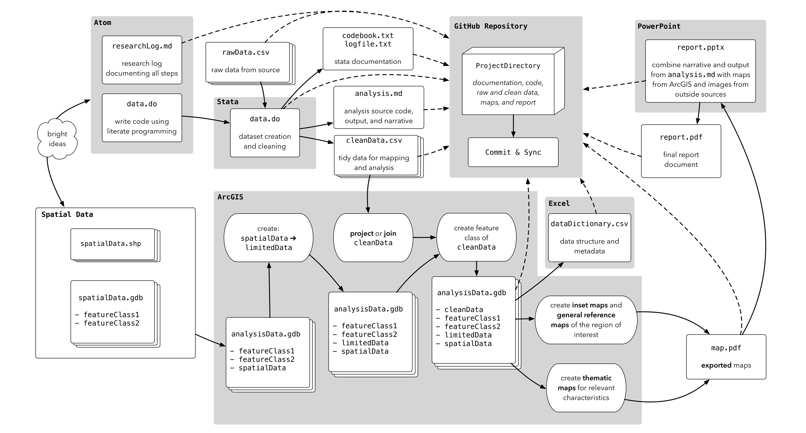

# "Good Enough" Research Practices

This section introduces some of the core concepts that we will emphasize in this course throughout the semester. The title takes inspiration from a recent article titled ["Good Enough Practices in Scientific Computing"](https://arxiv.org/abs/1609.00037)^[Wilson, G., Bryan, J., Cranston, K., Kitzes, J., Nederbragt, L. and Teal, T.K., 2016. Good Enough Practices in Scientific Computing. *arXiv preprint arXiv:1609.00037.*]. The authors note in their introduction that scientific computing advice can sometimes be both overwhelming and focused on tools that are inaccessible to many analysts. Their goal, and the goal of this course, is to de-mystify the simplist tools that enable researchers to streamline their workflows:

> Our intended audience is researchers who are working alone or with a handful of collaborators on projects lasting a few days to a few months, and who are ready to move beyond emailing themselves a spreadsheet named `results-updated-3-revised.xlsx` at the end of the workday...Many of our recommendations are for the benefit of the collaborator every researcher cares about most: their future self.

I would argue that the skills they describe are useful beyond just a few months. Indeed, most of the skills here can dramatically improve students' dissertation experiences:

> Most importantly, these practices make researchers more productive individually by enabling them to get more done in less time and with less pain. They also accelerate research as a whole by making computational work (which increasingly means all work) more reproducible. But progress will not happen by itself. Universities and funding agencies need to support training for researchers in the use of these tools. Such investment will improve confidence in the results of computational work and allow us to make more rapid progress on important research questions.

While much of what we will talk about in this course is aimed at supporting your work, there are benefits that extend beyond your dissertation or your research projects. These benefits, which include developing sustainable workflows and structuring the way you interact with your own computer, can make everyday computing practices like checking email or organizing files an easier, more structured process.

## Reproducibility

One of the mantras of this course is our emphasis on reproducibility. The unifying feature of all of the "good enough" research practices discussed below is that they contribute to a more reproducible research product.

Reproducibility is very much in vogue right now for number of reasons. [Assessments of studies in psychology](http://science.sciencemag.org/content/349/6251/aac4716)^[Open Science Collaboration, 2015. Estimating the reproducibility of psychological science. *Science*, 349(6251), p.aac4716.], for example, have found weaker on average effect sizes and far fewer statistically significant results than the initial studies reported. There have also been high profile instances of falsified research, including [research by a graduate student at UCLA](http://nymag.com/scienceofus/2015/05/how-a-grad-student-uncovered-a-huge-fraud.html). This particular instance of fraud was identified by graduate students intent on replicating the original study.

At the same time, there is a recognition that the skills necessary for producing reproducible research are not being fostered in academic disciplines and graduate programs. Thus one of the goals of this course, and this **User's Guide** in particular, is to help develop a working knowledge of many of these skills.

One challenge, however, is that reproducibility does not have a consistent definition. Some researchers use the term to narrowly refer to code that can execute without alteration on a person's computer. Others use it to refer to research designs that can be replicated by other researchers. Still others discuss reproducibility as the ability to obtain a similar set of results or draw similar inferences from identical research designs.

When we talk about reproducibility in this class. We'll be primarily concerned with **methods reproducibility**:

> the ability to implement, as exactly as possible, the experimental and computational procedures, with the same data and tools, to obtain the same results.^[Goodman, S.N., Fanelli, D. and Ioannidis, J.P., 2016. What does research reproducibility mean?. *Science translational medicine*, 8(341), pp.341ps12-341ps12.]

Methods reproducibility in statistics means that other analysts have full access to both the original data and the steps used to render those original data into a final research product, such as a set of regression models This is increasingly seen not just a matter of good research methodology, but as a matter of research ethics as well. Being able to be transparent with research decreases the potential for cases like the [fraudulent dissertation research conducted by a UCLA graduate student named Michael LaCour](http://nymag.com/scienceofus/2015/05/how-a-grad-student-uncovered-a-huge-fraud.html). It was the efforts of [two Stanford graduate students who wanted to reproduce LaCour's findings](https://fivethirtyeight.com/features/how-two-grad-students-uncovered-michael-lacour-fraud-and-a-way-to-change-opinions-on-transgender-rights/) that ultimately led to the identification of problematic work.

For statistics, methods reproducibility is derived from a number of sources. The first source is the use of **computer code** for working with data. Rather than making manual changes to tabular data in a spreadsheet application like Microsoft Excel, computer code provides detailed records of each individual alterations. Code can be used execute tasks repeatedly, meaning that errors can be easily fixed if they are discovered an hour, a day, a week, or a month later. During this semester, we'll use `R`'s programming language to execute reproducible data cleaning processes.

The second source of reproducibility in statistics is therefore derived from the **documentation** that we create to accompany our research products. These documents outline where our data originated, what specific variables mean (a codebook), what steps were taken to create specific maps (a research log), and how our data files are organized (a metadictionary).

Our code can also be used as documentation if it is written using [literate programming](https://en.wikipedia.org/wiki/Literate_programming) techniques. In `R`, these techniques produce well annotated output that "weaves" together code, output, and narrative text that describes the function of the code and the results of the output.

The third and final primary source of reproducibility in statistics is derived from our **organizational approach** to our work. Statistics projects can require many megabyes of data spread across dozens of data files, scripts, and output files. A disorganized file system can make replicating your work difficult if not impossible. Much of the research practices discussed in the remainder of this section are aimed at supporting one or more of these three major sources of reproducibility.

## Thinking in Workflows

One way to increase the reproducibility of a project is to approach each and every task with purposeful organization and thoughtfulness. **Workflows** are the processes that we use to approach a given task. Think of checking your email. You (hopefully!) follow a series of steps when you check your email that help you organize your inbox. In our reading for the first week of classes, [Scott Long](http://www.indiana.edu/~jslsoc/)^[Long, J.S., 2009. *The workflow of data analysis using Stata.* College Station, TX: Stata Press.] describes a structured strategy for approaching statistical research. In Long's model, a data analysis project consists of four steps: (a) data cleaning, (b) analysis, (c) presenting results, and (d) protecting files. This is a useful model to build upon, and one that we will discuss over the course of the semester.

Even more useful, not just for statistical work but for any process, are the tasks Long lays out for each step in the data analysis workflow:

  1. Planning
  2. Organization
  3. Documentation
  4. Execution

A good example of the utility of extending this logic to other workflows is with the problem sets. The "typical" approach students take with homework assignments is to sit down, open up their software, and start with question 1. Using Long's four task approach, a workflow-based strategy to the assignment would involve beginning by reading the assignment through in its entirety to develop a **plan** for approaching it - think about what techniques and skills are needed for each step. With a plan in place, you can proceed to **organizing** yourself for the assignment - identifying and obtaining files that you will need, creating dedicated directories for saving assignment data, and getting any necessary software documentation. After pulling together all of these materials, you are ready to move on to **documentation** - setting up your assignment code and output files, and (later in the course) your research log and meta-dictionary. Once you are set-up, you would then begin to address individual assignment questions as part of the **execution** task.

The goal here is to approach everything you do for research or work with an element of mindfulness and structure about your process. This mental model for approaching research supports the creation of **reproducible** research products because we approach our work in a routinized, predictable, organized, and efficient manner. Thinking in terms of workflows also encourages a greater awareness of the complexity of tasks, which also helps you plan more accurately for how long a particular task or project will take.

In reality, there will be multiple workflows that you find yourself navigating. You will want a structured process not just for approaching a large spatial research project like the final project, but also a process for maintaining notes related to a specific assignment, a process for documenting code, a process for approaching assignments, and even a process for backing your data up. As you go through the course, think about how to best integrate these ideas into your work habits.

## Course Tools

This course relies on a number of major tools to help us accomplish the work that we need to do. This makes for a complex learning curve, particularly at the beginning of the semester. The tools we've selected for this class have been picked not necessarily because they are the *easiest* tools to learn, but because they *increase* our ability to conduct reproducible research.

### `R` and RStudio
`R` is actually a programming language that was originally intended to support statistical computing and graphics. In recent years, it has become a multi-purpose language capable of producing not only statistical output but sophistical data visualizations, maps, and even qualitative and textual analyses. To show you how flexible and powerful `R` can be, the [website](https://slu-soc5050.github.io) for this class and even this book were both written entirely with `R`! This flexiblity is enabled by *packages*, which are user-written programs that build upon `R`'s base code to create new *functions*. Functions are the building blocks `R`'s syntax that allow us to work with our data.

RStudio is what is known as an integrated development environment, or "IDE". It provides a suite of tools for interacting with the `R` programming language, many of which will make our work easier and more reproducible. For that reason, we won't be using `R` directly this semester, but rather working with it through RStudio.

### Atom
While RStudio does have a built-in do-file editor, and you could easily use it to author code for `R`, writing in an external text editor has a number of advantages. Atom is a free, highly extensible, and easy to use text editor. Unlike RStudio's do-file editor, it is not tied to a single application or programming language. Atom, on the other hand, offers a large number of user-written packages that dramatically extend its base capabilities. One of those, `language-r`, gives Atom support for working with Stata's do-file format. 

As we progress through the semester, we'll also use a number of packages for writing and previewing Markdown text files. These are particularly important because RStudio does not have a spell checking function. So, while using Atom means adding an additional tool to your workflow, it also offers a number of improvements over what RStudio comes built in with. We'll describe all of this further in the chapters on "Introducing Atom", "Introducing Markdown", and "Reproducible Notebooks".

### GitHub
The final tool we'll use, GitHub and its desktop application GitHub Desktop, is an exceptionally powerful tool for conducting version control on an entire directory. This allows you to track changes in individual files as well as changes that impact an entire sub-folder or entire project directory. GitHub is increasingly recognized as one of the key tools available for making research reproducible because it allows users to maintain logs of every change they make on a project. It also offers other tools that support project management, including to-do lists, issue tracking, and even website maintenance. GitHub, and the software that powers it called Git, are both described further in the "Introduction to GitHub".

## Course Workflow
One of the largest learning curves with this course is keeping track of how all of these tools fit together. As we said above, it is important for you to being thinking in workflows. We've mapped out the major aspects of our course workflow to help aid that process:

```{r echo=FALSE, out.width = '100%'}
knitr::include_graphics("images/gisFlow1.png")
```

This workflow is premised on a common GISc situation: you have data stored in some type of database in a **tabular** or spreadsheet-like format that have a **spatial reference** like an address, which would allow them to be mapped. This main dataset of interest needs cleaning, as real world data often do, before it can be mapped. We'll use code written in Atom and executed by Stata to accomplish this task. We'll also use Atom to maintain and edit documentation that helps you increase the reproducibility of your work.

Once the data are cleaned, we'll want to start working on mapping them. This cannot occur in a vacuum. Rather, you will need to seek out data sources that describe the physical or human geography in the area of interest. These may come as **shapefiles** or **geodatabases**, and they may also require some sort of data cleaning. Often the spatial data we have access to cover a larger area than what we need, or they cover too small an area and have to be merged with other files to capture the extent we require.

Once both our tabular and spatial data are cleaned, we can bring our tabular data in ArcGIS so that we can further clean it, if necessary, and map it. When we have maps ready for export, we often combine them into deliverables like presentations or printed booklets. This is best accomplished outside of ArcGIS in an application like PowerPoint or Word, or a more advanced publishing tool.

Finally, as we noted above, we will capture and track *almost* all of these files using GitHub:

```{r echo=FALSE, out.width = '100%'}

```

This workflow captures every aspect of a project from the bright idea that launches it to data acquisition, data cleaning, mapping, dissemination, and archiving.
